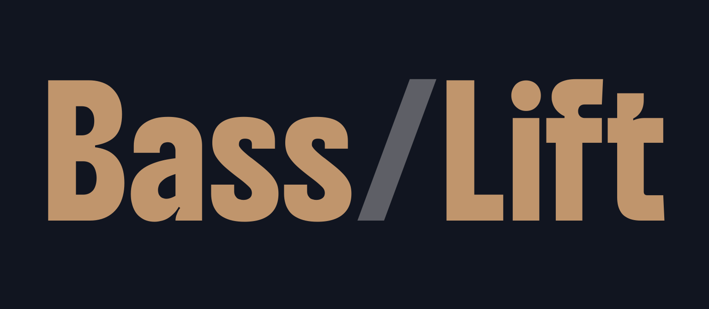

# BassLift

<p align="center">
  
</p>

Local audio tool that does two things:

1. **Bass → Tablature** — extracts the bass line from a song, transcribes it to notes, and generates a 4-string bass tab (with optional MIDI export and isolated bass WAV).
2. **Vocals + Instrumental split** — separates a song into two stems (vocals/drums/bass/other + the rest) and lets you download both as WAV.

Everything runs locally on your machine. No audio is ever uploaded to a third-party server.

> **Warning**
> This project is **experimental** — not even beta. Expect breaking changes, rough edges, and incomplete features. Use at your own risk.

> **Hardware note**
> BassLift works best on machines with a modern GPU (NVIDIA with CUDA support) or Apple Silicon (M1/M2/M3/M4). CPU-only mode works but source separation will be significantly slower.


## How it works

- **Source separation:** [Demucs](https://github.com/facebookresearch/demucs) (Hybrid Transformer model, `htdemucs`)
- **Pitch detection:** [librosa](https://librosa.org/) — probabilistic YIN (`pyin`)
- **Backend:** FastAPI + Uvicorn
- **Frontend:** single static HTML file (no build step)

## Requirements

- Python 3.9+
- ~4 GB RAM
- ~500 MB disk for Demucs model weights (downloaded on first run)
- A modern browser (Chrome, Firefox, Edge, Safari)
- **Recommended:** a modern GPU (NVIDIA with CUDA) or Apple Silicon for reasonable processing times

## Quick start

```bash
# 1. Clone the repo
git clone https://github.com/<your-username>/basslift.git
cd basslift

# 2. (Recommended) create a virtual environment
python -m venv .venv
# Windows:
.venv\Scripts\activate
# macOS/Linux:
source .venv/bin/activate

# 3. Install dependencies
pip install -r requirements.txt

# 4. Start the backend
uvicorn server:app --port 8000

# 5. Open the frontend
# Just double-click bass_tab_app.html, or open it in your browser
```

The frontend will auto-detect the backend at `http://localhost:8000`.

## Modes

### Bass → Tablature

Upload a song, pick options, hit run. Output is an ASCII tab plus optional MIDI / isolated bass WAV.

Tunable parameters:

| Setting | Default | Notes |
|---|---|---|
| Demucs model | `htdemucs` | `htdemucs_ft` is more accurate but ~3× slower |
| Detection threshold | 40 (out of 127) | Lower = more notes (incl. ghost notes), higher = only confident notes |
| Tuning | E A D G | Standard 4-string bass; supports drop tunings |
| Quantization | 1/16 | Also: 1/8, 1/8T, 1/16T (triplets) |

### Vocals + Instrumental split

Upload a song, choose what to extract (vocals, drums, bass, or other), hit run. Get two WAV files back.

## API endpoints

If you want to integrate the backend into your own tool:

```
GET  /health                 → version info
POST /extract                → bass tab pipeline (multipart form)
POST /separate               → stem split (multipart form)
GET  /download/{file_id}     → fetch a cached stem WAV
```

See `server.py` for full parameter docs.

## Limitations

- Pitch detection is monophonic — chords on the bass won't be transcribed correctly.
- Slap, pull-off, hammer-on, slides, and ghost notes aren't detected as techniques.
- BPM detection works well for steady tempos. Free-time playing will produce odd results.
- The detection threshold is the most important knob. Start at 40 and adjust to taste.

## License

MIT — see [LICENSE](LICENSE).

## Acknowledgements

- [Demucs](https://github.com/facebookresearch/demucs) by Meta AI Research
- [librosa](https://librosa.org/) for audio analysis
- [FastAPI](https://fastapi.tiangolo.com/) for the backend
