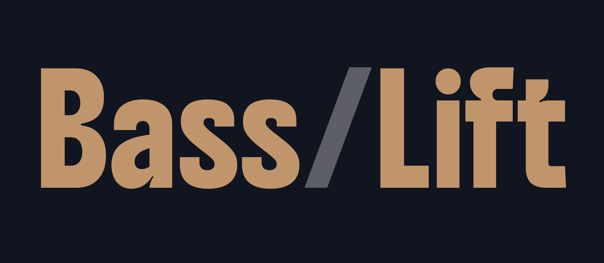

# BassLift

<p align="center">
  
</p>

Local audio tool that does two things:

1. **Bass → Tablature** — extracts the bass line from a song, transcribes it to notes, and generates a 4-string bass tab (with optional MIDI, MusicXML export and isolated bass WAV).
2. **Vocals + Instrumental split** — separates a song into two stems (vocals/drums/bass/other + the rest) and lets you download both as WAV.
3. **Metronome** — built-in play-along metronome with tap tempo, auto-filled BPM from extraction.

Everything runs locally on your machine. No audio is ever uploaded to a third-party server.

> **Experimental** — this is a personal project in active development. Expect rough edges, breaking changes, and quirky behavior on edge cases. Feedback and issues welcome.
>
> **Best on modern GPU or Apple Silicon.** Demucs separation is the heaviest step — a 3-minute song takes ~5-30 seconds on an NVIDIA GPU (CUDA) or Apple Silicon (M1/M2/M3/M4 via MPS), versus 2-4 minutes on CPU. See [GPU acceleration](#gpu-acceleration-strongly-recommended) below.


## How it works

- **Source separation:** [Demucs](https://github.com/facebookresearch/demucs) (Hybrid Transformer model, `htdemucs`)
- **Pitch detection:** two engines, selectable in the UI:
  - [librosa](https://librosa.org/) — probabilistic YIN (`pyin`) with median filtering, octave error correction, and adaptive confidence thresholds (default, fast)
  - [CREPE](https://github.com/maxrmorrison/torchcrepe) — neural pitch tracker (torchcrepe, `full` model). Substantially more accurate for bass, especially in the low register. Downloads ~150 MB of model weights on first use. Uses GPU automatically when available.
- **Backend:** FastAPI + Uvicorn
- **Frontend:** single static HTML file (no build step)

## Requirements

- Python 3.9+
- ~4 GB RAM (CPU mode) or ~2 GB VRAM (GPU mode)
- ~500 MB disk for Demucs model weights (downloaded on first run)
- A modern browser (Chrome, Firefox, Edge, Safari)

### GPU acceleration (strongly recommended)

Demucs is built on PyTorch and automatically uses your GPU if available. Without GPU acceleration, separating a 3-minute song takes 2–4 minutes on CPU; with GPU it takes 5–30 seconds.

**NVIDIA (CUDA)** — install PyTorch with CUDA support *before* installing the rest. Pick the right CUDA version for your driver at <https://pytorch.org/get-started/locally/>. Example for CUDA 12.1:

```bash
pip install torch torchaudio --index-url https://download.pytorch.org/whl/cu121
```

Then install the other dependencies:

```bash
pip install -r requirements.txt
```

Verify GPU is detected:

```bash
python -c "import torch; print('CUDA:', torch.cuda.is_available(), '| Device:', torch.cuda.get_device_name(0) if torch.cuda.is_available() else 'CPU')"
```

**Apple Silicon (M1/M2/M3/M4)** — PyTorch's MPS (Metal Performance Shaders) backend is included by default. Just run `pip install -r requirements.txt` and it works. Verify:

```bash
python -c "import torch; print('MPS:', torch.backends.mps.is_available())"
```

**CPU only** — works everywhere, no extra setup. Just slower.

## Quick start

```bash
# 1. Clone the repo
git clone https://github.com/<your-username>/basslift.git
cd basslift

# 2. (Recommended) create a virtual environment
python -m venv .venv
# Windows:
.venv\Scripts\activate
# macOS/Linux:
source .venv/bin/activate

# 3. Install dependencies
pip install -r requirements.txt

# 4. Start the backend
uvicorn server:app --port 8000

# 5. Open the frontend
# Just double-click bass_tab_app.html, or open it in your browser
```

The frontend will auto-detect the backend at `http://localhost:8000`.

## Modes

### Bass → Tablature

Upload a song, pick options, hit run. Output is an ASCII tab plus optional MIDI / MusicXML / isolated bass WAV. Built-in audio players let you listen to the original track and separated stems directly in the browser.

Tunable parameters:

| Setting | Default | Notes |
|---|---|---|
| Demucs model | `htdemucs` | `htdemucs_ft` is more accurate but ~3× slower |
| Detection threshold | 40 (out of 127) | Lower = more notes (incl. ghost notes), higher = only confident notes |
| Tuning | E A D G | Standard 4-string bass; supports drop tunings |
| Quantization | 1/16 | Also: 1/8, 1/8T, 1/16T (triplets) |

### Vocals + Instrumental split

Upload a song, choose what to extract (vocals, drums, bass, or other), hit run. Get two WAV files back.

### Metronome

Always-visible play-along metronome with a BPM input (30–300) and tap tempo. After extraction, the detected BPM auto-fills the metronome. Audio click with visual beat indicator flash.

## API endpoints

If you want to integrate the backend into your own tool:

```
GET  /health                 → version info
POST /extract                → bass tab pipeline (multipart form); returns tab, MIDI, MusicXML, time signature
POST /separate               → stem split (multipart form)
GET  /download/{file_id}     → fetch a cached stem WAV
GET  /bass/{file_id}         → fetch isolated bass stem
```

See `server.py` for full parameter docs.

## Limitations

- Pitch detection is monophonic — chords on the bass won't be transcribed correctly.
- Slap, pull-off, hammer-on, slides, and ghost notes aren't detected as techniques.
- Time signature detection supports 3/4 and 4/4 only. Other time signatures default to 4/4.
- BPM detection uses multi-method cross-validation and works well for steady tempos. Free-time playing will produce odd results.
- The detection threshold is the most important knob. Start at 40 and adjust to taste.

## License

MIT — see [LICENSE](LICENSE).

## Acknowledgements

- [Demucs](https://github.com/facebookresearch/demucs) by Meta AI Research
- [librosa](https://librosa.org/) for audio analysis
- [FastAPI](https://fastapi.tiangolo.com/) for the backend
